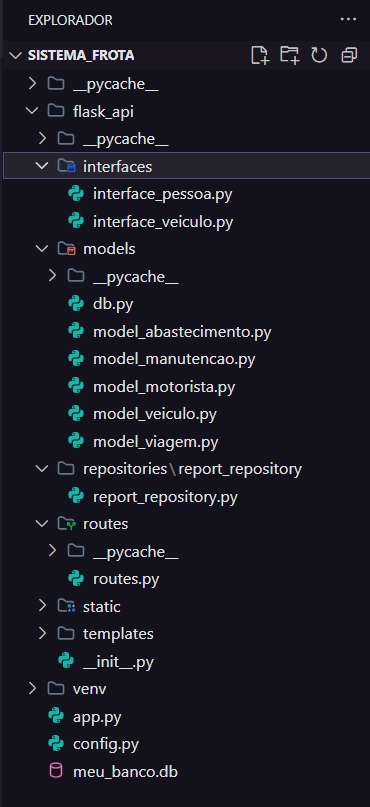
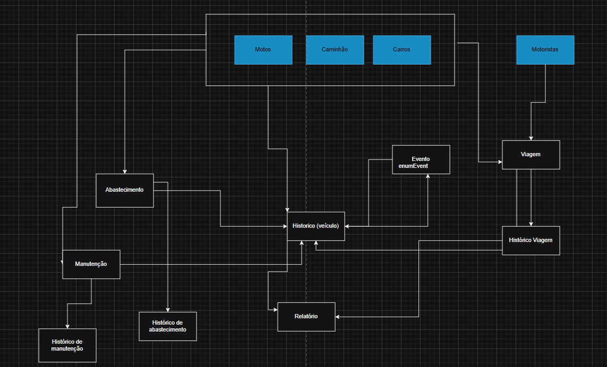

# SISTEMA DE GERENCIAMENTO DE FROTA DE VEÍCULOS
Repositório para a cadeira de POO. Construção de um sistema de gerenciamento de frota de veículos utilizando programação orientada a objetos.

## 📝 Descrição do Projeto e Objetivo
O **Gerenciamento de frota** é uma API mínima desenvolvida com **Flask** e persistência em **SQlite** para gerenciar a frota de veículos e motoristas de uma transportadora. Seu objetivo é otimizar a eficiência operacional e controlar custos, garantindo a conformidade e fornecendo dados analíticos.

O sistema aplica conceitos avançados de POO, como o uso de um repositório desacoplado da lógica de negócio e regras de negócio configuráveis (lidas via config.py), o que torna a manutenção e a adaptação do projeto mais fáceis.

## 🧱 Classes de Domínio (Models) - Especificação Resumida
As classes de domínio (flask_api/models/) definem o universo do negócio, utilizando Herança, Encapsulamento e Métodos Especiais.

### Entidades da Frota e Motoristas
A classe Veiculo é a base que define atributos como placa, quilometragem e status. Ela utiliza o método especial __lt__ (menor que) para permitir a ordenação no ranking de eficiência. As classes Carro, Motocicleta e Caminhao aplicam Herança Simples a partir de Veiculo; o Caminhao adiciona o atributo capacidade_toneladas.

A classe Motorista contém cpf (chave) e cnh_categoria. É vital usar Encapsulamento para proteger e validar esses campos essenciais para as regras de alocação.

### Entidades de Eventos e Histórico
*  Todos os registros de histórico herdam da classe base Evento, que define data e veiculo_placa.

*  Manutencao herda de Evento e registra o custo e tipo_servico, sendo fundamental para o cálculo do custo médio.

* Abastecimento herda de Evento e registra litros e valor_pago, usado para monitorar a eficiência de combustível.

*  Viagem herda de Evento e registra distancia_percorrida_km e motorista_cpf, atuando como o gatilho para a atualização automática da quilometragem do veículo após cada deslocamento.

### Entidade de Configuração
A classe Configuracao armazena os parâmetros de negócio configuráveis, como o limite_revisao_km e a cnh_minima_por_tipo_veiculo, garantindo que as políticas sejam facilmente ajustáveis através do arquivo config.py.

## ⚙️ Classes de Serviço e Relatórios (Citação)
Estas classes orquestram a aplicação da lógica e as interações com o repositório.

**Serviços (Services):** Classes como MotoristaService (que valida CNH versus tipo de veículo) e AlocacaoService (que bloqueia a alocação se o veículo estiver indisponível ou em manutenção) aplicam a lógica de validação da empresa.

**Relatórios (Reports):** A classe RelatoriosService (ou ReportRepository) é responsável por executar queries analíticas complexas para gerar o ranking de eficiência, o custo médio de manutenção e a quilometragem média por tipo de veículo.

## Estrutura do diretório do projeto (Inicial)

## Diagrama de classes Textual do Projeto
### Veículo (Carro, Moto e Caminhão) | 

| Atributos | Métodos |
| :--- | :--- |
| **PLACA** | **CRUD** |
| **MODELO** | **HISTÓRICO** |
| **ANO** | |
| **QUILOMETRAGEM** | |
| **CUSTO MÉDIO (KM/L)** | |
| **STATUS** (Ativo, Inativo ou Manutenção) | |

### Motorista

| Atributos | Métodos |
| :--- | :--- |
| NOME | CRUD |
| CPF | VALIDAÇÃO AUTOMÁTICA (CNH) |
| CAT. CNH | |
| EXP (ANOS) | |
| DISPONIBILIDADE | |

---

### Manutenção

| Atributos | Métodos |
| :--- | :--- |
| TIPO DA MANUTENÇÃO | MARCAR VEÍCULO COMO: “EM MANUTENÇÃO” |
| PLACA DO VEÍCULO (IDENTIFICADOR) | ASSOCIAR VEÍCULO E ARMAZENAR HISTÓRICO |

---

### Abastecimento

| Atributos | Métodos |
| :--- | :--- |
| PLACA DO VEÍCULO (IDENTIFICADOR) | REGISTRAR ABASTECIMENTO |
| TIPO GASOLINA | CALCULAR CONSUMO MÉDIO / VEICULO (KM/L) |
| DATA | LISTAR VEÍCULOS COM CONSUMO FORA DO PADRÃO |
| LITROS | |
| VALOR PAGO | |

---

### Viagem

| Atributos | Métodos |
| :--- | :--- |
| PLACA DO VEÍCULO (IDENTIFICADOR) | ATUALIZAR QUILOMETRAGEM DO VEÍCULO APÓS VIAGEM |
| CPF MOTORISTA (IDENTIFICADOR) | BLOQUEAR ALOCAÇÃO DE VEÍCULO SE: MANUTENÇÃO OU INATIVO |
| ORIGEM | |
| DESTINO | |
| DISTANCIA | |

---

### Relatórios

| Atributos | Métodos |
| :--- | :--- |
| REPOSITÓRIO VEÍCULOS | CUSTO TOTAL E MÉDIO DA MANUTENÇÃO POR TIPO DE VEÍCULO |
| REPOSITÓRIO MOTORISTAS | RANKING DE EFICIENCIA (KM/L) |
| | TOTAL DE VIAGENS POR MOTORISTA |
| | QUILOMETRAGEM MÉDIA POR TIPO DE VEÍCULO |

## Diagrama Visual

  

